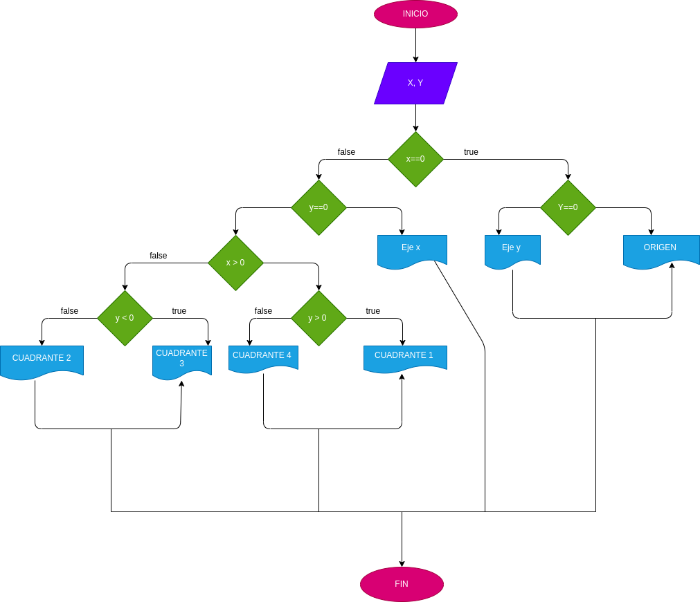

# taller_-condicionales
Programa que lea las coordenadas cartesianas (x, y) de un punto en el plano y calcule el cuadrante al cual pertenece el punto. Si el punto está sobre un eje también debe indicarlo.
# diagrama de flujo 

