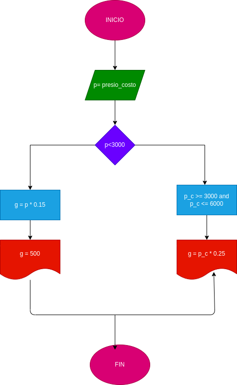

El dueño de una papelería desea un programa que le indique el precio de venta
de un articulo dado. El precio se calcula con la siguiente fórmula:
P = precioCosto + ganancia. Donde la ganancia sera 
# diagrama de flujo 
